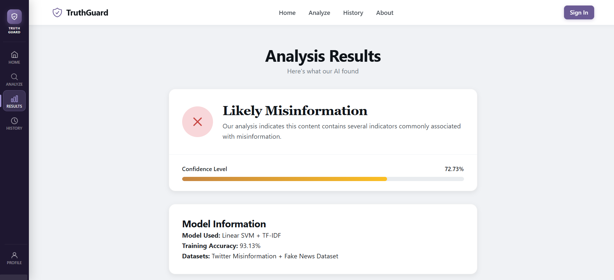
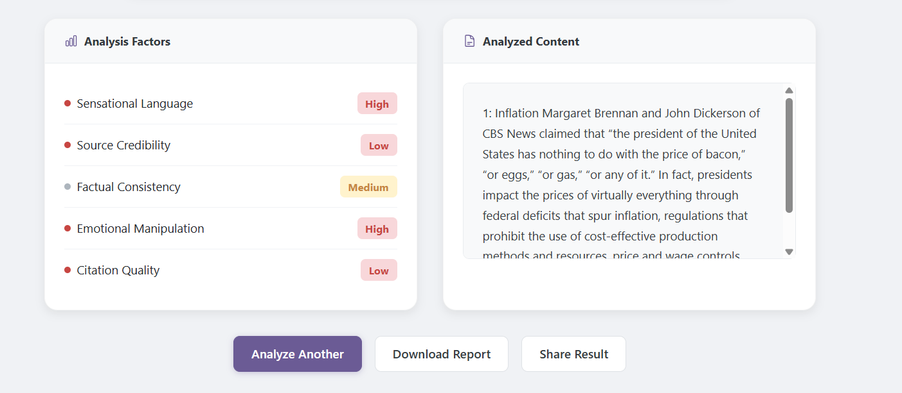

# Fake News Detection System

A machine learning-based web application that classifies news articles as **Real** or **Fake** using Natural Language Processing (NLP) and Machine Learning techniques.

---

## Project Overview

This project was developed as part of a university computing project to explore misinformation detection and text classification using machine learning models.

The system allows users to enter news content and receive real-time predictions through a web-based interface.

The application consists of:

- React frontend for user interaction
- FastAPI backend for API services
- Machine Learning model built using Scikit-Learn
- TF-IDF vectorization for feature extraction
- Text preprocessing pipeline for data cleaning and preparation

---

## Features

- Real-time fake news prediction
- News article text analysis
- Interactive web interface
- RESTful API integration
- Machine learning-based classification
- Data preprocessing and feature extraction

---

## Technologies Used

### Frontend

- React.js
- JavaScript
- HTML
- CSS

### Backend

- FastAPI
- Python

### Machine Learning

- Scikit-Learn
- Pandas
- NumPy
- TF-IDF Vectorizer

### Development Tools

- Git
- GitHub

---

## System Architecture

User Input
↓
React Frontend
↓
FastAPI Backend
↓
TF-IDF Feature Extraction
↓
Machine Learning Model
↓
Prediction Result

---

## Screenshots

### Home Page

### Prediction Example 1

### Prediction Example 2

### Data Visualization

---

## Skills Demonstrated

- Machine Learning
- Natural Language Processing (NLP)
- Data Preprocessing
- Full-Stack Development
- REST API Development
- Model Integration
- Data Analysis
- Problem Solving

---

## Future Improvements

- Deep Learning-based classification
- User authentication system
- Prediction history tracking
- Cloud deployment
- Model performance optimization
- Enhanced analytics dashboard

---

## Author

**Anthony Chin Zheng Yong**

Bachelor of Computer Science (Cybersecurity)

Swinburne University of Technology
